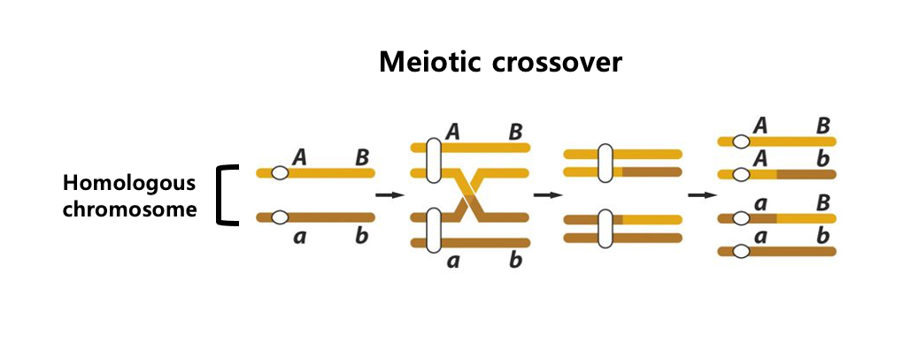

# [ICB 2022] Midterm exam
> It is recommended to write answer directly on Github web. It will help you save time and avoid git related problems.

Please write your answers to the files corresponding to the questions. For example,
> - Question: Q1-1
> - Answer: `./answer/A1-1.txt`

Like the assignments, you may either (1) clone the repository and submit to the repository or (2) edit the answer file directly at the github website.

Except for free text questions, all the submitted answers will be graded with
automated scripts. Please be careful of the typos.

---

## Q1
This is the structure of `/home` folder.
> Suppose that the resulf of 'echo &HOME' command was '/home'. 
```
├── harry
│   ├── chamber.txt
│   └── stone.txt
├── hermione
│   └── necklace.txt
└── ron
    ├── frost.txt
    ├── proj1
    │   ├── data.txt
    │   └── workflow.sh
    └── wand.txt
```

1. Write a command to move harry's chamber.txt to ron's proj1 directory, using absolute path. (`A1-1.txt`) (1 point)

2. Suppose you are in ron's proj1 directory. Write a command to open necklace.txt. (`A1-2.txt`) (1 point)
    - Don't use 'cd'
    - Use relative path
    - Use 'vim' to open a file.

3. Suppose you are in ron's proj1 directory. Move to 'hermione' directory and make a new directory 'proj2' there. (`A1-3.txt`) (1 point)
    - Use 'cd' once.
    - Use relative path.

4. Usig absolute path, copy hermione's necklace.txt to hermione's proj2 directory. (`A1-4.txt`) (1 point)

---

## Q2
Assemble these reads using a de bruijn graph approach (k=3)
- CCAGC
- AGCAG
- CCCAG 
- CAGCT 
 
1. List all the edges of the de bruijn graph of kmers in `A2-1.csv` with a format as follows: (3 points) 
   > Write the edges in the order of the given reads. So the first source and target should be CCA and CAG, repectively.

   ```
   source,target
   CCA,CAG
   ...
   ```

2. Write the final assembly result(s) (`A2-2.txt`). (4 points) 
    > Find the shortest path over the graph that visit all the edges at least one time.

---

## Q3
1. Fill in the alignment matrix with Smith-Waterman algorithm (`A3-1.csv`) (3 points) 
> Keep it mind : You can use web resource.
type        | score
------------|------
match       | +5
mismatch    | -3
gap penalty | -2

```
- | - | C | C | G | C | T |
--|---|---|---|---|---|---|
- | 0 | 0 | 0 | 0 | 0 | 0 |
C | 0 |   |   |   |   |   |
C | 0 |   |   |   |   |   |
A | 0 |   |   |   |   |   |
T | 0 |   |   |   |   |   |
C | 0 |   |   |   |   |   |
```

2. Write the alignment result (`A3-2.txt`). (1 points) 
```sh
# Alignment result format example
ATGC # Sequence of horizontal axis 
A-GC # Sequence of vertical axis
```

3. Write CIGAR string of alignment below. (`A3-3.txt`). (2 points) 
```sh
GARFIELDTH-EVERY----FASTCAT (reference sequence) 
GAR----DTHHEVE--LASTFA-TCAT (query sequence)
```

---

## Q4


Find the figure of structural variants that correspond to those listed below and write the alphabet of the figure. (`A4.csv`) (4 points) 
1. Insertion in R 
2. Insertion in Q
3. Inversion
4. Tandem duplication
5. Dispersed duplication
```
# Example
# If a = 1, b = 2, c = 3, d = 4, f = 5
# Notice: No 'e' in the figure.
a,b,c,d,f 
```

---

## Q5.
Suppose that you are going to compare the alignment results of these two sequences.
- Query: GARFIELDTHELASTFATCAT
- Target: GARFIELDTHEVERYFASTCAT

The alignment result of two sequences is given as `Alignment 1`.

   ```sh
    # Alignment 1
    GARFIELDTHEVERYFAST---CAT (reference sequence)
    GARFIELDTHE----LASTFATCAT (query sequence)
   ```

Calculate the score and the identity of the `Alignment 1` based on the score table below. (`A5.txt`)(3 points)

    type                  | score
    ----------------------|------
    match                 | +1
    mismatch              | -1
    gap opening penalty   | -3
    gap extension penalty | -1

   > Report identity as percentage with 2 decimal places.

   > Don't include "%" character in the answer.

   > **Normalize identity with the alignment length.**

---

## Q6.
This is a fasta file, `scaffold.fasta`.
```
> contig1
ACGGCAGCTTCTGCAA
> contig2
CCCAGCTGAATAGAC
> contig3
CCCTGACAGGGT
> contig4
CCGTGGAACT
> contig5
CCAGACATA
> contig6
CCAGCAT
> contig7
GCTGAT
> contig8
AGCCG
> contig9
GATT
```
1. Calculate GC percent of **contig4**. (`A6-1.txt`) (2 points)
   > Please provide the number without percentage symbol (No "%" in the answer)

2. Calculate *N50* of `scaffolds.fasta` (`A6-2.txt`) (2 points)

---

## Free text questions

Questions from Q7 to Q8 are free text questions.
There is no limit on the amount, but please write it as briefly as possible.
Please write your answers in English to corresponding text files.

## Q7.
What is the advantage of long read sequencing for genomic assembly compared to short reads? (`A7.txt`) (4 points) 

---

## Q8.

The most popular model plant, Arabidopsis (2n = 10), had multiple distinct popluations which is called ecotypes. Each ecotype has SNPs that are shared within the ecotype. SNPs of one ecotype are different from those of other ecotypes. Let's say you have two ecotypes, A and B. And you know their SNP information. Because they are of the same species, you can cross them. How would you design an experiment to obtain the frequency distribution of meiotic crossover over the genome? Please describe the experimental setup, technology, software used, and how you would carry out such an experiment. (`A8.txt`) (5 points) 
> There isn't a fixed answer. There are multiple possible ways.
> You can extract DNA from any part of the plant and from any generations you want.
   
