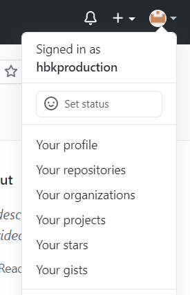
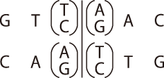
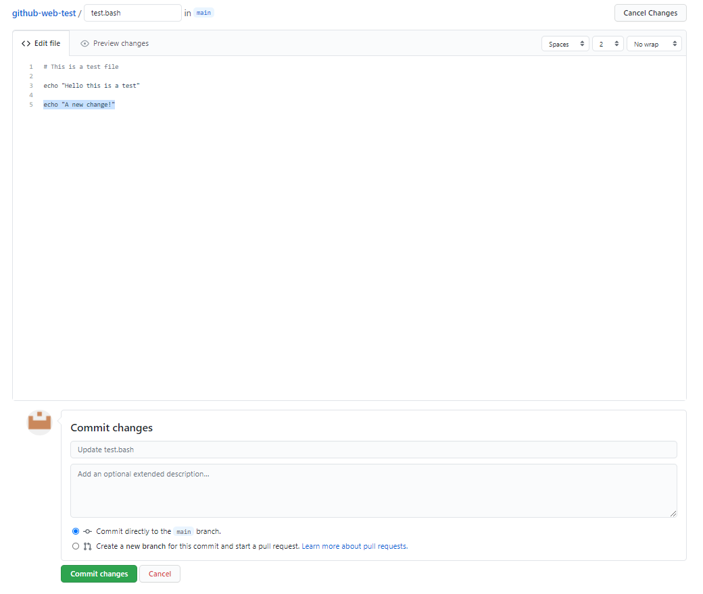

# [Integrative Computational Biology] Assignment

# Part 1. Basic bash, awk, and file handling

The goal of this part is to improve skills working with basic bash commands and awk in UNIX environment.

> Commands to learn:
> wget, gzip, mkdir, mv, cd, ls, grep, wc, head, cat, pipe "|",
> awk, uniq, sort, file redirection with '>'

---

## 1-1. Handling FASTA files

### command01.sh
1. Print your student number and github ID and copy the printed result to **student_id.txt**.
The format should be like "2021-#####,harryporter".
    > You can check your github ID at the top right corner of the github page.
    

2. Download the fasta file with NCBI accession. The downloaded file should be named as "NC_045512.2.fasta" (No result file)
- NCBI accession number: NC_045512.2
- Download link:
    - https://www.ncbi.nlm.nih.gov/search/api/sequence/NC_045512.2/?report=fasta

### command02.sh
1. Print first 5 lines of the downloaded fasta file and copy the printed result to **result02_1.txt**.

2. How many lines are in this fasta file except for the header line? (The header lines start with ">".)
Print the number of lines except header lines and save the number to **result02_2.txt**.

3. How many lines of this fasta file contain "AAAAA"?
Print the number of lines with "AAAAA" and save the number to **result02_3.txt**.

4. From the fasta file, print the first 5 lines containing "GGTTC" and copy the printed result to **result02_4.txt**.

### command03.sh
1. Restriction enzymes cut DNA by acting only on certain motifs (motif means specific sequences of bases).
EcoRI is a well-known restriction enzyme from *E. coli* and is used in various molecular genetics techniques.
Identify the motif of EcoRI by searching online, print the number of motifs in the fasta file and save the number to **result03_1.txt**.
    > EcoRI motif consists of 6 bases.
    > Don't consider the sites split by the new line character - just count the sites fully contained in a line.

2. Another restriction enzyme, HincII from *Haemophilus influenzae* recognizes a specific nucleotide pattern like this:

    

    Print the number of HincII recognition sites in the fasta file and save the number to
    **result03_2.txt**.
    > Don't consider the sites split by the new line character. Try using regular expressions.

3. Print the number of bases (A, T, G, C) in the fasta file and fill in the numbers of **result03_3.csv**.

---

## 1-2. Handling GTF files

### command04.sh
1. Download the GTF file of Drosophila melanogaster and save it as **d_melanogaster.genes.gtf.gz** in the "data" directory. (No result file)

   Link: ftp://ftp.ensembl.org/pub/release-103/gtf/drosophila_melanogaster/Drosophila_melanogaster.BDGP6.32.103.gtf.gz

2. Extract the gzip-compressed GTF file. (No result file)

3. The header lines of GTF file begin with "#". Use a command to extract only
   the header line from a GTF file and store the result to **result04_3.txt** in the "result" directory.

### command05.sh

1. Count genes of each chromosome in "d_melanogaster.genes.gtf" and find **the chromosomes which have 100 or more genes**.
   Sort chromosome names alphabetically and write the **chromosome names as column 1** and
   the **count of genes as column 2** to **result05_1.csv**.
   > You can find the structure of GTF file from [this link](https://en.wikipedia.org/wiki/General_feature_format)
   > Columns in CSV file, which means Comma-Separated Values, should be separated with comma, ",".
   > When counting the number of genes in a chromosome, count the lines of which the feature type is "gene".

2.  Extract the distinct genomic feature types (e.g., gene, exon, transcript ...) from the GTF file.
    Sort the values alphabetically and save them to **result05_2.txt**.

### command06.sh
1. Find the line in which the feature type is "gene" and the gene name is "Raf".
   Save the line to **result06_1.txt**.

2. The "Raf" gene has multiple transcripts. Find all transcripts and store the attribute "transcript_name" (e.g., transcript_name "Raf-RE"; ) to **result06_2.txt**.
   > You can use "tr" command with "-d" option for removing unwanted characters including double quotes or semicolons.
   ```sh
   echo '"""HELLO WORLD!!"""' | tr -d '"' # Result: HELLO WORLD!!
   # Multiple characters can be added with "|".
   echo 'gene_name "Raf";' | tr -d '"|;' # Result: gene_name Raf
   ```

3. Count the number of exons of each transcript from "Raf" gene and save the count to **result06_3.csv** (remember CSV files are comma separated). Write the **transcript names (value of transcript_name) as column 1** and the **count of exons as column 2** like this:
   ```
   Raf-XX,5
   Raf-AA,3
   ...
   ```

4. Calculate the total exon length of each transcript from "Raf" gene and save the result to **result06_4.csv**.
   Write the **transcript names as column 1** and the **length of exons as column 2** like this:
   ```
   Raf-XX,3300
   Raf-AA,2500
   ...
   ```
   > The position of GTF is 1-based, which means the 100nt-length region from 1st position to 100th position in chromosome 1 is represented as "chr1 1 100". Please consider this when calculating
   > the length from position indices.

---

# Part 2. Assembly and SNP calling

The goal of this part is to assemble a genome from sequencing reads (SPAdes) and
to get SNPs from the pairwise alignment of the assembled genome and the reference sequence (MUMMER).

## Tools
### SPAdes: [link for manual](https://github.com/ablab/spades/blob/spades_3.15.1/README.md)
SPAdes is an assembler toolkit containing various assembly pipelines.
In this exercise, you will use the k-mer based assembly module of SPAdes.

### MUMMER: [link for manual](https://mummer4.github.io/manual/manual.html)
MUMMER is a pairwise aligner. It can align:
    - whole genomes to other genomes
    - large genome assemblies to one another
    - partial (draft) genomes sequences to one another
    - or (with release 4) a set of reads to a genome.
Visualization of pairwise alignment can be done by mummerplot.

## Assembly and SNP calling
### command07.sh
1. Download [paired-end sequencing](https://www.biostars.org/p/267167/) reads as **SRR13668359_1.fastq.gz**
   and **SRR13668359_2.fastq.gz** in the data directory (No result file)
   - Link for Read 1: ftp://ftp.sra.ebi.ac.uk/vol1/fastq/SRR136/059/SRR13668359/SRR13668359_1.fastq.gz
   - Link for Read 2: ftp://ftp.sra.ebi.ac.uk/vol1/fastq/SRR136/059/SRR13668359/SRR13668359_2.fastq.gz
   > You don't have to uncompress the downloaded files.

2. Download GTF file of SARS-Cov-2 and unzip it as **sars_cov_2.genes.gtf** in the data directory. (No result file)
   - Link: ftp://ftp.ensemblgenomes.org/pub/viruses/gtf/sars_cov_2/Sars_cov_2.ASM985889v3.101.gtf.gz


### command08.sh
1. Assemble downloaded sequence reads with SPAdes.
   - INPUT: `SRR13668359_1.fastq.gz`, `SRR13668359_2.fastq.gz`
   - OUTPUT DIRECTORY: `./sars_cov_2`
   > The command for executing SPAdes is explained in the [manual](https://github.com/ablab/spades/blob/spades_3.15.1/README.md)
   > Please specify the output directory by adding "-o" option.
   > Please run SPAdes with "--only-assember" option to speed up.

2. Align the reference genome and scaffolds assembled with SPAdes with MUMMER.
   Save the output of MUMMER as **sars_cov_2.mums** in result directory. (Result files: **sars_cov_2.mums**)
   - INPUT: `NC_045512.2.fasta`, `scaffolds.fasta`
   - OUTPUT: `sars_cov_2.mums`
   > `scaffolds.fasta` will be located in the output directory of previous step.
   > **NC_045512.2.fasta** from `command01.sh` will be used as SARS-Cov-2 reference genome in this part.

3. Visualize the alignment result with mummerplot.
   Save the output plot as **sars_cov_2.png** in the result directory. (Result files: **sars_cov_2.png**)
   - INPUT: `sars_cov_2.mums`, `NC_045512.2.fasta`, `scaffolds.fasta`
   - OUTPUT: `sars_cov_2.png`

### command09.sh
1. Generate snp report for **scaffolds.fasta** and save the snp report as
   **sars_cov_2.snps** in the result directory. (Result file: **sars_cov_2.snps**)
   - INPUT: `NC_045512.2.fasta`, `scaffolds.fasta`
   - OUTPUT: `sars_cov_2.snps`
   > You can use the "show-snps" command from MUMMER. Please refer to the [manual](https://mummer4.github.io/manual/manual.html).

2. With the SNPs, it is possible to find out which clade this virus belongs to.
   The SNPs of SARS-Cov-2 clades are saved at `./data/clade/` named with the clade names
   given by [Nextstrain](#Nextstrain).

   Find out the shared SNPs between the clade and **sars_cov_2.snps**.
   You can use either **join.awk**, or "join" command to find if two files have identical join fields.
   With the SNPs, find the clade which shares most SNPs with **sars_cov_2.snps**
   and save the name of clade to **clade-name.txt** in the result directory. (Result file: **clade-name.txt**)

   - INPUT: `sars_cov_2.snps`, `./data/clade/*.txt`
   - OUTPUT: `clade_name.txt`

   The clade SNP file is formatted as follows:
   ```sh
   # 19A.txt
   14408	C
   8782	C
   ```
   The first column is the position of the SNP in the reference genome and
   the second column is the alternate allele of the SNP.

   The SNP report from MUMMER is formatted as follows:
   ```sh
   1|   PATH_TO/REFERENCE.fasta PATH_TO/QUERY.fasta
   2|   NUCMER
   3|
   4|   [P1]	[SUB]	[SUB]	[P2]	[BUFF]	[DIST]	[R]	[Q]	[CTX R]	[CTX Q]	[FRM]	[TAGS]
   5|   241	C	T	203	203	203	0	0	ATCTAGGTTTCGTCCGGGTGT	ATCTAGGTTTTGTCCGGGTGT	1	1	NC_045512.2	NODE_1_length_29851_cov_400.428644
   ```
   The first column is the position of the SNP in the reference genome and the second column is the allele from the reference sequence. The third column is the alternate allele found from the query sequence
   and the fourth column is the position of the SNP in the query genome. You can find the detail of format
   [here](https://mummer4.github.io/manual/manual.html).

   > If two or more clades tie, select the clade with less clade-specific SNPs.
   > Clade-specific SNPs mean that SNPs which is in the clade and not in the SNPs of assembly.

   > If you use 'join' command, please sort the input files before running the command.
   > [link](https://www.gnu.org/software/coreutils/manual/html_node/Sorting-files-for-join.html#Sorting-files-for-join)
   ```sh
   sort -k 1b,1 file1 > file1.sorted
   sort -k 1b,1 file2 > file2.sorted
   join file1.sorted file2.sorted > file3
   ```
   > As the first 4 lines of `sars_cov_2.snps` cannot be joined with SNPs,
   > you may create a sorted copy of `sars_cov_2.snps` without first 4 lines.

   > You can use 'join' with '-a' option to show the lines which is not joined.
   ```sh
   join -a 1 file1.sorted file2.sorted # print unpairable lines in file1.sorted
   join -a 2 file1.sorted file2.sorted # print unpairable lines in file2.sorted
   ```

---

# How-to Guides

## 1. Setup
We recommend to use google cloud shell editor if you don't have any bash environment
available. If you want to use your local environment, you can always use yours but
[**docker**](https://www.docker.com/get-started) must be pre-installed and available for setting dependencies.

About cloud shell editor, see [CloudShellEditor section](#CloudShellEditor).

If you open the terminal, please clone this repository to your working directory
and change the current directory to the cloned directory.
```sh
git clone <GITHUB_REPOSITORY_LINK>
cd ./<GITHUB_REPOSITORY_NAME>
```
After cloning, execute "setup.sh"
```sh
./setup.sh
```
If "setup.sh" executed well, you can see the username changed to "assignment".
The copied repository is at "~/assignment" and please work within this directory.

## 2. Execution
Please write your commands to commandXX.sh and submit the whole repository by pushing
the repository. You can run your all "commandXX.sh" files with "main.sh" or run
independently.
- Run with main.sh
    ```sh
    bash ./main.sh
    ```
- Run commandXX.sh independently
    ```sh
    bash ./command/commandXX.sh
    ```
If you can't execute a shell file due to "Permission denied" error, please try this command.
```sh
chmod +x ./<SOME_SHELL_FILENAME>.sh
./<SOME_SHELL_FILENAME>.sh
```

## 3. Submission

To submit your result, follow these steps:

- Step 1. Write your commands in commandXX.sh in the "command" directory
- Step 2. Write the result to ./result/resultXX_X.txt or ./result/resultXX_X.csv
    > "." is relative path for current working directory and "./result/" is the directory named "result" in the current directory.
    > For the first exercise, please copy the numbers or results from the terminal and paste it to result files.
    > From the second exercise, you may use redirection to files.
- Step 3. Add edited files to git and commit. You can use the commands below or GUI of cloud shell editor.
    ```sh
    # Tell git who you are.
    git config --global user.email "you@example.com"
    git config --global user.name "Your Name"
    # Update the change.
    git add .
    git commit -m "Initial commit" # The message can be changed as you want.
    ```
- Step 4. Submit your answers by pushing the cloned repository.
    ```sh
    git push origin master
    ```
    You may need to enter your github ID and password in this step.

If you have problems with using git, you can use the interface of github.
You can edit commandXX.sh or resultXX.txt directly in the github repository web site as follows:
- Step 1. Click a file to edit and click the pencil icon at the top right corner.
  When you hover the cursor over the icon, you will see the phrase "Edit this file".
  
- Step 2. Edit the file with the text editor and click the green button with "Commit changes".
  

You can submit your result multiple times and the last version before the deadline will be graded.

## 4. CloudShellEditor

Guide document by Google is great: [link to guide](https://cloud.google.com/shell/docs/launching-cloud-shell-editor).

You must have a Google account to use cloud shell (SNU account is fine).
You can start to work on this exercise in Cloud shell as follows:
1. Open the link [https://ide.cloud.google.com](https://ide.cloud.google.com)

2. Open a terminal from the cloud shell editor. You can open a new terminal
by clicking the icon contains ">_" or selecting terminal at the menu.


As a free service, Google Cloud Shell has some limitations. Please check these
before doing your jobs.

#### Limitations

- It takes some time when initiating.
- 5GB storage limit
- Cannot be opened with secret mode of browser
- **If the session is inactive for 20 minutes, the instance is terminated and any modifications outside $HOME will be deleted.**
- Weekly usage limitation: ~50hrs
- If you don't access cloud shell for 120 days, the $HOME will be erased.

**WARNING: Please don't provide your billing information unless you use google cloud platform.**

---

If you have problems or questions, please mail to khb7840@snu.ac.kr