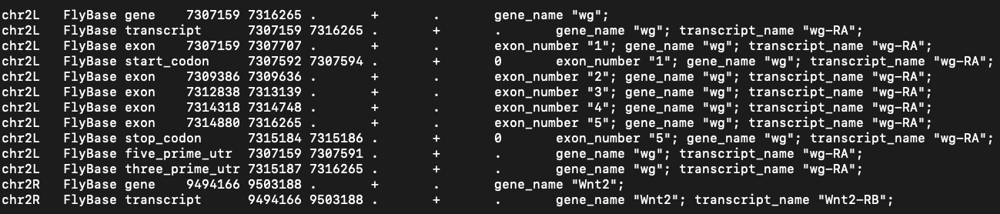
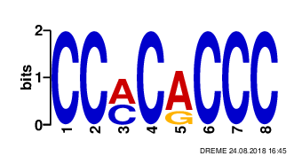

# [Integrative Computational Biology 2021] Final-term exam

Please write your answers to the files corresponding to the questions. For example,
> - Question: Q1-1
> - Answer: `./answer/A1-1.txt`

Like the assignments, you may either (1) clone the repository and submit to the repository or (2) edit the answer file directly at the github website.

First two questions, `Q1` and `Q2`, can be time-consuming for people who are not familiar with linux commands. Please plan accordingly.

Except for free text questions, all the submitted answers will be graded with
automated scripts. Please be careful of the typos.

---

## Q1. Write the correct answers.
This is the structure of `/home` folder.
```
├── harry
│   ├── chamber.txt
│   └── stone.txt
├── hermione
│   └── necklace.txt
└── ron
    ├── frost.txt
    ├── proj1
    │   ├── data.txt
    │   └── workflow.sh
    └── wand.txt
```

> Please use absolute paths for all commands except for `Q1-2`.
> Don't put '/' at the end of the directory name (for grading).

1. Image you are the user `harry` and you are at `/home/harry`.
Write a command to change the current directory to `hermione` by using the absolute path.
(`A1-1.txt`)

2. Write a command to change the current directory from `hermione` to `proj1` by using the relative path. (`A1-2.txt`)

3. You are now at the `proj1` directory and typed `ls` command.
Write the expected result of the command. (`A1-3.txt`)
   > The files should be separated with the whitespace.

4. You are in the `/home` folder. Write a command to create a new directory `proj2` in
`hermione` folder by using the absolute path. (`A1-4.txt`)

5. You want to move `data.txt` from `proj1` to `proj2` and rename it as `data2.txt`.
Write a command to do the job using the absolute paths. (`A1-5.txt`)

6. Write a command to copy `workflow.sh` from the `proj1` folder to the `proj2`
folder using the absolute path. (`A1-6.txt`)

7. Write a command to remove the `proj1` directory using the absolute path. (`A1-7.txt`)
   > Add options for **recursive** and **forcible** removal of files.

8. You are now at the `proj2` folder and this is the structure of `proj2`.
    ```
    .
    ├── data2.txt
    └── workflow.sh
    ```
    You want to save the **first 15 lines** of `data2.txt` to `first15.txt` and
    **last 5 lines** of `data2.txt` to `last5.txt` in the `proj2` folder.
    Write commands to do the task using absolute paths and file redirection. (`A1-8.txt`)


## Q2.
This is a gtf file, `d_melanogaster.wnt.gtf`.



1. Write the expected output of this command. (`A2-1.txt`)
    ```sh
    awk -F'\t' '{ print $3 }' d_melanogaster.wnt.gtf | sort | uniq  -c
    ```

2. Write the expected output of this command. (`A2-2.txt`)
    ```sh
    awk -F'\t' '{print NR}' d_melanogaster.wnt.gtf
    ```

3. Write the expected output of this command. (`A2-3.txt`)
    ```sh
    awk -F'\t' '{print NF}' d_melanogaster.wnt.gtf
    ```

4. Write a command to calculate the total exon length of transcript **"wg-RA"**
. (`A2-4.txt`)

5. Write a command that prints all annotations within the range 7307159 to 7316265 in chr2L. (`A2-5.txt`)
> This question may be difficult. Please don't spend too much time on this question.

## Q3.
This is a fasta file, `contigs.fasta`.
```
> contig1
ACGGCAGCTTCTGCA
CCCAGCTGAATAGAG
CCCTGACAGGGATCG
CCGTGGAACAGGACA
TTAGTTCCACACCCG
> contig2
CCAGACATACGTGAC
CCAGCAGCTGATCAG
AGCCGCCGAGATTAG
AGCCTCTGCCAATCT
TTCCCCGCCCGGGGG
```
1. Write a command to get all lines with `AGC` from `contigs.fasta`. (`A3-1.txt`)

2. Write the expected result of this command. (`A3-2.txt`)
    ```sh
    grep -v '>' contigs.fasta | grep -o 'CG' | wc -l
    ```

3. Write a command to find start codon and three stop codons and color them. (`A3-3.txt`)

4. A sequence logo is a graphical representation of the sequence conservation of nucleotides. The relative sizes of the letters indicate their frequency in the sequences and the total height of the letters depicts the information content of the position in bits [(wikipedia)](https://en.wikipedia.org/wiki/Sequence_logo).

   This is a logo for a sequence motif.

   

   Write a command to get the count of this motif in `contigs.fasta`. (`A3-4.txt`)
   > Don't consider the motifs between two lines.

## Q4.
Fill in the alignment matrix with Smith-Waterman algorithm (`A4-1.csv`) and write the possible alignment result (`A4-2.txt`).

type        | score
------------|------
match       | +1
mismatch    | -1
gap penalty | -1

```
- | - | T | C | A | G | C | C |
--|---|---|---|---|---|---|---|
- | 0 | 0 | 0 | 0 | 0 | 0 | 0 |
T | 0 |   |   |   |   |   |   |
C | 0 |   |   |   |   |   |   |
G | 0 |   |   |   |   |   |   |
C | 0 |   |   |   |   |   |   |
C | 0 |   |   |   |   |   |   |
```

```sh
# Alignment result format example
ATGC
A-GC
```

## Q5.

Here we have a 5-bp sequence and we are going to calculate the
probability of this sequence based on two 1st order Markov models.

```
> sequence A
ACGGT
```

0th order Markov model is given like this.

```
- | P(A) | P(T) | P(G) | P(C)
--|------|------|------|-----
p | 0.25 | 0.25 | 0.25 | 0.25
```

1. The table below is the transition matrix of **Model 1** built with general DNA sequences.
Calculate the probability `P(ACGGT|Model1)`. (`A5-1.txt`)

   ### Model1: 1st order Markov model of general DNA

   ```
      -   | P(A|N) | P(T|N) | P(G|N) | P(C|N)
   -------|--------|--------|--------|-------
   P(N|A) | 0.3    | 0.2    | 0.3    | 0.2
   P(N|T) | 0.15   | 0.3    | 0.3    | 0.25
   P(N|G) | 0.25   | 0.2    | 0.3    | 0.25
   P(N|C) | 0.3    | 0.3    | 0.1    | 0.3
   ```

2. The table below is the transition matrix of **Model 2** built with sequences from CpG Islands.
Calculate the probability `P(ACGGT|Model2)`. (`A5-2.txt`)

    ### Model2: 1st order Markov model of CpG Island

    ```
       -   | P(A|N) | P(T|N) | P(G|N) | P(C|N)
    -------|--------|--------|--------|-----
    P(N|A) | 0.2    | 0.1    | 0.4    | 0.3
    P(N|T) | 0.1    | 0.2    | 0.4    | 0.3
    P(N|G) | 0.15   | 0.1    | 0.4    | 0.35
    P(N|C) | 0.2    | 0.2    | 0.3    | 0.3
    ```

3. If the probabilities of two models are given as follows, which model better represents the sequence? Write the name of the model (`Model1` or `Model2`).
(`A5-3.txt`)

    ```
    P(Model1) = 0.4, P(Model2) = 0.6
    ```

## Q6.
This is the read counts from RNA-seq experiments. Fill in the **table 1** (`A6-1.csv`) and **table 2** (`A6-2.csv`).
> Please follow the calculation steps in the lecture slide.
> Round to the third decimal places.

Genename (size) | Sample 1 | Sample 2
----------------|----------|---------
Gene A (100kB)  | 80       | 21
Gene B (50kB)   | 10       | 20
Gene C (5kb)    | 8        | 5
Gene D (1kb)    | 2        | 4

### Table 1. RPKM (A6-1.csv)

Genename (size) | Sample 1 (RPKM) | Sample 2(RPKM)
----------------|-----------------|---------------
Gene A (100kb)  |                 |
Gene B (50kb)   |                 |
Gene C (5kb)    |                 |
Gene D (1kb)    |                 |

### Table 2. TPM (A6-2.csv)

Genename (size) | Sample 1 (TPM) | Sample 2(TPM)
----------------|----------------|--------------
Gene A (100kb)  |                |
Gene B (50kb)   |                |
Gene C (5kb)    |                |
Gene D (1kb)    |                |


## Q7.
Find all possible ORFs from this sequence and the reverse complement sequence.
ORF should have a start codon (ATG) and stop codons (TGA,TAA,TAG).
```
>unknown_DNA_fragment
TCTACTGGATGGCCATTCTCTCAGAGTAA
```
Please save the found ORFs in `A7.fasta` formatted like this:
```sh
# Sort the ORFs based on their lengths (longest comes first)
>ORF1
ATGAAATAG
>ORF2
ATGTAA
```


## Q8.
Suppose that you are going to compare the alignment results of these two sequences.
- Query: GARFIELDTHELASTFATCAT
- Target: GARFIELDTHEVERYFASTCAT

The alignment result of two sequences is given as `Alignment 1`.

   ```sh
    # Alignment 1
    GARFIELDTHEVERYFAST---CAT (reference sequence)
    GARFIELDTHE----LASTFATCAT (query sequence)
   ```

Calculate the score and the identity of the `Alignment 1` based on the score table below. (`A8.csv`)

    type                  | score
    ----------------------|------
    match                 | +1
    mismatch              | -1
    gap opening penalty   | -3
    gap extension penalty | -1

   > Report identity as percentage with 2 decimal places.

   > Don't include "%" character in the answer.

   > **Normalize identity with the alignment length.**

---

## Free text questions

Questions from `Q9` to `Q11` are free text questions.
There is no limit on the amount, but please write it as briefly as possible.
Please write your answers in English to corresponding text files.

## Q9.
You got a set of novel amino-acid sequences from an experiment.
Please design a pipeline to annotate the functions of the sequences
(`A9.txt`)

## Q10.
You got novel genome sequences from an extraterrestrial planet. 
These genomes consist of 4 bases as ours. 
How can you show that the genes from extraterrestrial genomes are encoded in a similar way (or not) to genomes on earth? 
Please design an *in silico* experiment for answering this question. (`A10.txt`)

## Q11.
Your collaborators try to test a hypothesis that altered pseudogene expression is
involved in specific type of cancer development. How would you design an experiment
to check if their hypothesis is correct/incorrect? Please describe the experimental setup,
technology, software used, and how you would carry out such an experiment. (`A11.txt`)


